# 🤖 CrewAI Projects Collection

A comprehensive collection of autonomous AI agent workflows built using the [CrewAI](https://crewai.com) framework. This repository demonstrates how multi-agent systems can collaborate to automate complex tasks ranging from content creation to financial analysis.

## All Agentic Systems

| Project Name | Description |
| :--- | :--- |
| **Article Writer** | Agents that research topics and draft high-quality articles. |
| **Customer Outreach Campaign** | Automates lead generation and personalized email outreach. |
| **Customer Support Automation** | Handles inquiries and drafts responses based on knowledge bases. |
| **Event Planning Automation** | Coordinates logistics, venues, and schedules for events. |
| **Financial Analyst** | Analyzes market data and generates investment reports. |
| **News Agency** | Scrapes, curates, and summarizes the latest news. |
| **Tailor Job Applications** | Analyzes resumes against job descriptions to optimize applications. |

## 🛠️ Installation & Setup
```bash
# 1. Clone the repo
git clone [https://github.com/yourusername/CrewAI-Projects-Collection.git](https://github.com/yourusername/CrewAI-Projects-Collection.git)
cd CrewAI-Projects-Collection

# 2. Setup of Environment
python -m venv myenv
myenv\Scripts\activate #Windows
source myenv/bin/activate #Linux/Mac

# 3. Install Dependencies
pip install -r requirements.txt

# 4. Set Up Environment Variables
Rename '.env.example' to '.env' and add your API keys
```

# Agents Workflow
## AI Agent Article Writer
### Workflow

```mermaid
flowchart LR
    A{{📚 Researcher Agent}} --> B{{🖊️ Writer Agent}}
    B -->C{{✂️ Editor Agent}}
    C --> D@{ shape: delay, label: "📃 Final Article" }
    
    classDef default fill:##333300,stroke:#333,stroke-width:2.5px;
    classDef highlight fill:#333300,stroke:#4a90e2,stroke-width:3px;
    classDef large font-size:30px

    class A,B,C,D default;
    class D highlight;
```



### Preview of Agentic System


## 🤝 Contributions
Feel free to submit a Pull Request if you have ideas for new agents or optimizations for existing ones.